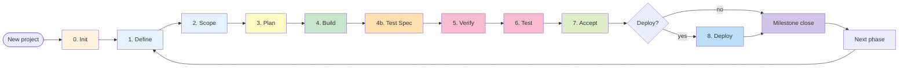

# VG Lifecycle — 8 Phases

VG enforces a deterministic pipeline. Each phase has REQUIRED artifacts, a slash command, and a gate contract that the next phase reads. **Skipping a phase = breaking the contract = next phase BLOCKs.**

Inspired by [addyosmani/agent-skills](https://github.com/addyosmani/agent-skills) lifecycle taxonomy (Define / Plan / Build / Verify / Review / Ship / Meta) but tightened: VG phases bind to gate contracts, not just discipline.

---

## Visual map

---

## Phase contracts

| Phase | Slash command | Required output (artifact) | Gates next phase reads |
|---|---|---|---|
| **0. Init** | `/vg:project` (legacy `/vg:init`) | `.vg/FOUNDATION.md`, `.vg/config.md`, `.vg/ROADMAP.md` | All downstream phases require these to exist |
| **1. Define** | `/vg:specs <N>` | `${PHASE_DIR}/SPECS.md` (frontmatter: phase, status=draft, required H2 sections) + `${PHASE_DIR}/INTERFACE-STANDARDS.md` (when API/UI surface) | `/vg:scope` validates SPECS schema before round 1 |
| **2. Scope** | `/vg:scope <N>` (5 rounds + deep probe) | `${PHASE_DIR}/CONTEXT.md` (decisions D-XX, monotonic), `DISCUSSION-LOG.md` | `/vg:blueprint` reads CONTEXT decisions; missing D-IDs → BLOCK |
| **3. Plan** | `/vg:blueprint <N>` | `${PHASE_DIR}/PLAN.md`, `API-CONTRACTS.md`, `TEST-GOALS.md`, `CRUD-SURFACES.md`, `INTERFACE-STANDARDS.md` | `/vg:build` validates blueprint schema + plan-vs-context coherence |
| **4. Build** | `/vg:build <N>` (wave-based parallel) | `${PHASE_DIR}/SUMMARY.md` (per-wave commits + per-task evidence) | `/vg:test-spec` reads build output and implemented surfaces |
| **4b. Test Spec** | `/vg:test-spec <N>` (post-build deep spec authoring) | `${PHASE_DIR}/DEEP-TEST-SPECS.md`, `LIFECYCLE-SPECS.json`, `TEST-FIXTURE-DAG.json`, `PLAYWRIGHT-SPEC-PLAN.md`, `TEST-SPEC-GAPS.md` | `/vg:review` verifies runtime against deep lifecycle contract |
| **5. Verify** | `/vg:review <N>` (code scan + browser discovery + fix loop) | `${PHASE_DIR}/RUNTIME-MAP.json`, `GOAL-COVERAGE-MATRIX.md` | `/vg:test` reads goals coverage matrix; pre-test-gate blocks if review BLOCKed |
| **6. Test** | `/vg:test <N>` (codegen + smoke + regression + security) | `${PHASE_DIR}/TEST-RESULTS.json` + Playwright spec files | `/vg:accept` validates test outcomes |
| **7. Accept** | `/vg:accept <N>` (UAT checklist + audit + reflector) | `${PHASE_DIR}/UAT.md` (verdict + bootstrap candidates) | Phase considered complete; milestone closer reads accept verdict |
| **8. Deploy** | `/vg:deploy [<N>]` (multi-env: sandbox/staging/prod) | `.vg/deploy/STATE.json` (project-level v3.0.0+) | Optional — does not block next phase Init |

---

## Sub-phases (drill-down)

### Phase 2 (Scope) — 5 rounds + 1 probe

| Round | Focus | Output enrichment |
|---|---|---|
| 1 | Domain | Business rules, invariants, edge actors |
| 2 | Technical | Stack constraints, performance budgets, integration boundaries |
| 3 | API | Endpoints, contract shapes, error modes |
| 4 | UI | User flows, modal states, validation rules |
| 5 | Tests | Goal phrasing, coverage scope, deferred items |
| Deep probe | Adversarial | What breaks? What's missed? |

### Phase 3 (Plan) — 4 sub-steps

1. `2a_plan` — task breakdown (PLAN.md with NN tasks)
2. `2b_api_contracts` — API-CONTRACTS.md (per-endpoint, schema-validated)
3. `2c_workflows` — multi-actor flow specs (when applicable)
4. `2d_test_goals` — TEST-GOALS.md + CRUD-SURFACES.md

### Phase 5 (Verify / Review) — fix loop

1. Code scan (linter / sast / lens-prompts adversarial)
2. Browser discovery (Playwright recursive lens probes)
3. Goal comparison (RUNTIME-MAP vs PLAN goals)
4. Fix loop (3-tier routing: inline / spawn / escalate, max 5 iterations)
5. CrossAI peer review (Codex + Gemini consensus)

---

## What advances vs what completes a phase

A phase **advances** when its slash command emits `<cmd>.completed` telemetry + writes its required artifact.

A phase **completes** when:
- All `must_emit_telemetry` events landed in events.db
- All `must_touch_markers` files exist under `.step-markers/`
- Schema validators pass for produced artifacts
- `vg-orchestrator run-complete` returns 0

If verdict=True (contract clean) but caller passed `--outcome BLOCK` (goal coverage failed), terminal prints `⚠ contract PASS, outcome=BLOCK` separately — see issue #170 / fix v2.79.1.

---

## Cycle vs sequential

VG phases are NOT strictly sequential within a milestone. Cycles are explicit:
- `/vg:debug` re-enters Build/Verify when a bug is found post-acceptance — focused, no full review sweep.
- `/vg:amend` modifies CONTEXT decisions mid-phase + cascades impact analysis (read-only by `vg-amend-cascade-analyzer` subagent).
- `/vg:roam` is a Verify-mode sub-pipeline for runtime-only investigations (no plan binding).

---

## Cross-references

- Skill discovery (which command for what intent): `_shared/discovery-flowchart.md`
- Engineering principles cited at gate boundaries: `_shared/eng-principles.md`
- Anti-rationalization tables: `_shared/rationalization-tables.md`
- Runtime routing: `commands/vg/next.md`
- Health diagnosis: `commands/vg/doctor.md`
