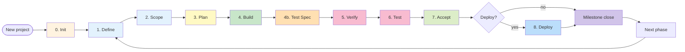

<codex_skill_adapter>
## Codex runtime notes

This skill body is generated from VGFlow's canonical source. Claude Code and
Codex use the same workflow contracts, but their orchestration primitives differ.

### Runtime lock

When this skill is running inside Codex, DO NOT switch to Claude CLI to execute
the workflow entrypoint. Keep the current Codex runtime, export
`VG_RUNTIME=codex`, use Codex `update_plan` for the compact visible task
window, and bind it with `vg-orchestrator tasklist-projected --adapter codex`.

`.claude/scripts/*` and `.claude/commands/*` are canonical VGFlow source
paths shared by both adapters; those paths do not mean the runtime changed to
Claude. References below to "Claude CLI", `TodoWrite`, or Haiku describe the
Claude adapter only. Codex must map them through this adapter contract instead
of aborting the current run and relaunching Claude.

### Tool mapping

| Claude Code concept | Codex-compatible pattern | Notes |
|---|---|---|
| AskUserQuestion | Ask concise questions in the main Codex thread | Codex does not expose the same structured prompt tool inside generated skills. Persist answers where the skill requires it; prefer Codex-native options such as `codex-inline` when the source prompt distinguishes providers. |
| Agent(...) / Task | Prefer `commands/vg/_shared/lib/codex-spawn.sh` or native Codex subagents | Use `codex exec` when exact model, timeout, output file, or schema control matters. |
| TaskCreate / TaskUpdate / TodoWrite | Compact Codex plan window + orchestrator step markers | Use `tasklist-contract.json` as source of truth. Do not paste the full hierarchy into Codex `update_plan`. Show at most 6 rows: active group/step first, next 2-3 pending steps, completed groups collapsed, and `+N pending`. After projecting, emit `vg-orchestrator tasklist-projected --adapter codex`. |
| Playwright MCP | Main Codex orchestrator MCP tools, or smoke-tested subagents | If an MCP-using subagent cannot access tools in a target environment, fall back to orchestrator-driven/inline scanner flow. |
| Graphify MCP | Python/CLI graphify calls | VGFlow's build/review paths already use deterministic scripts where possible. |

<codex_runtime_contract>
### Provider/runtime parity contract

This generated skill must preserve the source command's artifacts, gates,
telemetry events, and step ordering on both Claude and Codex. Do not remove,
skip, or weaken a source workflow step because a Claude-only primitive appears
in the body below.

#### Provider mapping

| Source pattern | Claude path | Codex path |
|---|---|---|
| Planner/research/checker Agent | Use the source `Agent(...)` call and configured model tier | Use native Codex subagents only if the local Codex version has been smoke-tested; otherwise write the child prompt to a temp file and call `commands/vg/_shared/lib/codex-spawn.sh --tier planner` |
| Build executor Agent | Use the source executor `Agent(...)` call | Use `codex-spawn.sh --tier executor --sandbox workspace-write` with explicit file ownership and expected artifact output |
| Adversarial/CrossAI reviewer | Use configured external CLIs and consensus validators | Use configured `codex exec`/Gemini/Claude commands from `.claude/vg.config.md`; fail if required CLI output is missing or unparsable |
| Haiku scanner / Playwright / Maestro / MCP-heavy work | Use Claude subagents where the source command requires them | Keep MCP-heavy work in the main Codex orchestrator unless child MCP access was smoke-tested; scanner work may run inline/sequential instead of parallel, but must write the same scan artifacts and events |
| Reflection / learning | Use `vg-reflector` workflow | Use the Codex `vg-reflector` adapter or `codex-spawn.sh --tier scanner`; candidates still require the same user gate |

### Codex hook parity

Claude Code has a project-local hook substrate; Codex skills do not receive
Claude `UserPromptSubmit`, `Stop`, or `PostToolUse` hooks automatically.
Therefore Codex must execute the lifecycle explicitly through the same
orchestrator that writes `.vg/events.db`:

| Claude hook | What it does on Claude | Codex obligation |
|---|---|---|
| `UserPromptSubmit` -> `vg-entry-hook.py` | Pre-seeds `vg-orchestrator run-start` and `.vg/.session-context.json` before the skill loads | Treat the command body's explicit `vg-orchestrator run-start` as mandatory; if missing or failing, BLOCK before doing work |
| `Stop` -> `vg-verify-claim.py` | Runs `vg-orchestrator run-complete` and blocks false done claims | Run the command body's terminal `vg-orchestrator run-complete` before claiming completion; if it returns non-zero, fix evidence and retry |
| `PostToolUse` edit -> `vg-edit-warn.py` | Warns that command/skill edits require session reload | After editing VG workflow files on Codex, tell the user the current session may still use cached skill text |
| `PostToolUse` Bash -> `vg-step-tracker.py` | Tracks marker commands and emits `hook.step_active` telemetry | Do not rely on the hook; call explicit `vg-orchestrator mark-step` lines in the skill and preserve marker/telemetry events |

Codex hook parity is evidence-based: `.vg/events.db`, step markers,
`must_emit_telemetry`, and `run-complete` output are authoritative. A Codex
run is not complete just because the model says it is complete.

Before executing command bash blocks from a Codex skill, export
`VG_RUNTIME=codex`. This is an adapter signal, not a source replacement:
Claude/unknown runtime keeps the canonical `AskUserQuestion` + Haiku path,
while Codex maps only the incompatible orchestration primitives to
Codex-native choices such as `codex-inline`.

### Codex spawn precedence

When the source workflow below says `Agent(...)` or "spawn", Codex MUST
apply this table instead of treating the Claude syntax as executable:

| Source spawn site | Codex action | Tier/model env | Sandbox | Required evidence |
|---|---|---|---|---|
| `/vg:build` wave executor, `model="${MODEL_EXECUTOR}"` | Write one prompt file per task, run `codex-spawn.sh --tier executor`; parallelize independent tasks with background processes and `wait`, serialize dependency groups | `VG_CODEX_MODEL_EXECUTOR`; leave unset to use Codex config default. Set this to the user's strongest coding model when they want Sonnet-class build quality. | `workspace-write` | child output, stdout/stderr logs, changed files, verification commands, task-fidelity prompt evidence |
| `/vg:blueprint`, `/vg:scope`, planner/checker agents | Run `codex-spawn.sh --tier planner` or inline in the main orchestrator if the step needs interactive user answers | `VG_CODEX_MODEL_PLANNER` | `workspace-write` for artifact-writing planners, `read-only` for pure checks | requested artifacts or JSON verdict |
| `/vg:review` navigator/scanner, `Agent(model="haiku")` | Use `--scanner=codex-inline` by default. Do NOT ask to spawn Haiku or blindly spawn `codex exec` for Playwright/Maestro work. Main Codex orchestrator owns MCP/browser/device actions. Use `codex-spawn.sh --tier scanner --sandbox read-only` only for non-MCP classification over captured snapshots/artifacts. | `VG_CODEX_MODEL_SCANNER`; set this to a cheap/fast model for review map/scanner work | `read-only` unless explicitly generating scan files from supplied evidence | same `scan-*.json`, `RUNTIME-MAP.json`, `GOAL-COVERAGE-MATRIX.md`, and `review.haiku_scanner_spawned` telemetry event semantics |
| `/vg:review` fix agents and `/vg:test` codegen agents | Use `codex-spawn.sh --tier executor` because they edit code/tests | `VG_CODEX_MODEL_EXECUTOR` or explicit `--model` if the command selected a configured fix model | `workspace-write` | changed files, tests run, unresolved risks |
| Rationalization guard, reflector, gap hunters | Use `codex-spawn.sh --tier scanner` for read-only classification, or `--tier adversarial` for independent challenge/review | `VG_CODEX_MODEL_SCANNER` or `VG_CODEX_MODEL_ADVERSARIAL` | `read-only` by default | compact JSON/markdown verdict; fail closed on empty/unparseable output |

If a source sentence says "MUST spawn Haiku" and the step needs MCP/browser
tools, Codex interprets that as "MUST run the scanner protocol and emit the
same artifacts/events"; it does not require a child process unless child MCP
access was smoke-tested in the current environment.

#### Non-negotiable guarantees

- Never skip source workflow gates, validators, telemetry events, or must-write artifacts.
- If Codex cannot emulate a Claude primitive safely, BLOCK instead of silently degrading.
- UI/UX, security, and business-flow checks remain artifact/gate driven: follow the source command's DESIGN/UI-MAP/TEST-GOALS/security validator requirements exactly.
- A slower Codex inline path is acceptable; a weaker path that omits evidence is not.
</codex_runtime_contract>

### Model tier mapping

Model mapping is tier-based, not vendor-name-based.

VGFlow keeps tier names in `.claude/vg.config.md`; Codex subprocesses use
the user's Codex config model by default. Pin a tier only after smoke-testing
that model in the target account, via `VG_CODEX_MODEL_PLANNER`,
`VG_CODEX_MODEL_EXECUTOR`, `VG_CODEX_MODEL_SCANNER`, or
`VG_CODEX_MODEL_ADVERSARIAL`:

| VG tier | Claude-style role | Codex default | Fallback |
|---|---|---|---|
| planner | Opus-class planning/reasoning | Codex config default | Set `VG_CODEX_MODEL_PLANNER` only after smoke-testing |
| executor | Sonnet-class coding/review | Codex config default | Set `VG_CODEX_MODEL_EXECUTOR` only after smoke-testing |
| scanner | Haiku-class scan/classify | Codex config default | Set `VG_CODEX_MODEL_SCANNER` only after smoke-testing |
| adversarial | independent reviewer | Codex config default | Set `VG_CODEX_MODEL_ADVERSARIAL` only after smoke-testing |

### Spawn helper

For subprocess-based children, use:

```bash
bash .claude/commands/vg/_shared/lib/codex-spawn.sh \
  --tier executor \
  --prompt-file "$PROMPT_FILE" \
  --out "$OUT_FILE" \
  --timeout 900 \
  --sandbox workspace-write
```

The helper wraps `codex exec`, writes the final message to `--out`, captures
stdout/stderr beside it, and fails loudly on timeout or empty output.

### Known Codex caveats to design around

- Do not trust inline model selection for native subagents unless verified in the current Codex version; use TOML-pinned agents or `codex exec --model`.
- Do not combine structured `--output-schema` with MCP-heavy runs until the target Codex version is smoke-tested. Prefer plain text + post-parse for MCP flows.
- Recursive `codex exec` runs inherit sandbox constraints. Use the least sandbox that still allows the child to write expected artifacts.

### Support-skill MCP pattern

Pattern A: INLINE ORCHESTRATOR. For MCP-heavy support skills such as
`vg-haiku-scanner`, Codex keeps Playwright/Maestro actions in the main
orchestrator and only delegates read-only classification after snapshots are
captured. This preserves MCP access and avoids false confidence from a child
process that cannot see browser tools.

## Invocation

Invoke this skill as `$vg-LIFECYCLE`. Treat all user text after the skill name as arguments.
</codex_skill_adapter>


# VG Lifecycle — 8 Phases

VG enforces a deterministic pipeline. Each phase has REQUIRED artifacts, a slash command, and a gate contract that the next phase reads. **Skipping a phase = breaking the contract = next phase BLOCKs.**

Inspired by [addyosmani/agent-skills](https://github.com/addyosmani/agent-skills) lifecycle taxonomy (Define / Plan / Build / Verify / Review / Ship / Meta) but tightened: VG phases bind to gate contracts, not just discipline.

---

## Visual map



---

## Phase contracts

| Phase | Slash command | Required output (artifact) | Gates next phase reads |
|---|---|---|---|
| **0. Init** | `/vg:project` (legacy `/vg:init`) | `.vg/FOUNDATION.md`, `.vg/config.md`, `.vg/ROADMAP.md` | All downstream phases require these to exist |
| **1. Define** | `/vg:specs <N>` | `${PHASE_DIR}/SPECS.md` (frontmatter: phase, status=draft, required H2 sections) + `${PHASE_DIR}/INTERFACE-STANDARDS.md` (when API/UI surface) | `/vg:scope` validates SPECS schema before round 1 |
| **2. Scope** | `/vg:scope <N>` (5 rounds + deep probe) | `${PHASE_DIR}/CONTEXT.md` (decisions D-XX, monotonic), `DISCUSSION-LOG.md` | `/vg:blueprint` reads CONTEXT decisions; missing D-IDs → BLOCK |
| **3. Plan** | `/vg:blueprint <N>` | `${PHASE_DIR}/PLAN.md`, `API-CONTRACTS.md`, `TEST-GOALS.md`, `CRUD-SURFACES.md`, `INTERFACE-STANDARDS.md` | `/vg:build` validates blueprint schema + plan-vs-context coherence |
| **4. Build** | `/vg:build <N>` (wave-based parallel) | `${PHASE_DIR}/SUMMARY.md` (per-wave commits + per-task evidence) | `/vg:test-spec` reads build output and implemented surfaces |
| **4b. Test Spec** | `/vg:test-spec <N>` (post-build deep spec authoring) | `${PHASE_DIR}/DEEP-TEST-SPECS.md`, `LIFECYCLE-SPECS.json`, `TEST-FIXTURE-DAG.json`, `PLAYWRIGHT-SPEC-PLAN.md`, `TEST-SPEC-GAPS.md` | `/vg:review` verifies runtime against deep lifecycle contract |
| **5. Verify** | `/vg:review <N>` (code scan + browser discovery + fix loop) | `${PHASE_DIR}/RUNTIME-MAP.json`, `GOAL-COVERAGE-MATRIX.md` | `/vg:test` reads goals coverage matrix; pre-test-gate blocks if review BLOCKed |
| **6. Test** | `/vg:test <N>` (codegen + smoke + regression + security) | `${PHASE_DIR}/TEST-RESULTS.json` + Playwright spec files | `/vg:accept` validates test outcomes |
| **7. Accept** | `/vg:accept <N>` (UAT checklist + audit + reflector) | `${PHASE_DIR}/UAT.md` (verdict + bootstrap candidates) | Phase considered complete; milestone closer reads accept verdict |
| **8. Deploy** | `/vg:deploy [<N>]` (multi-env: sandbox/staging/prod) | `.vg/deploy/STATE.json` (project-level v3.0.0+) | Optional — does not block next phase Init |

---

## Sub-phases (drill-down)

### Phase 2 (Scope) — 5 rounds + 1 probe

| Round | Focus | Output enrichment |
|---|---|---|
| 1 | Domain | Business rules, invariants, edge actors |
| 2 | Technical | Stack constraints, performance budgets, integration boundaries |
| 3 | API | Endpoints, contract shapes, error modes |
| 4 | UI | User flows, modal states, validation rules |
| 5 | Tests | Goal phrasing, coverage scope, deferred items |
| Deep probe | Adversarial | What breaks? What's missed? |

### Phase 3 (Plan) — 4 sub-steps

1. `2a_plan` — task breakdown (PLAN.md with NN tasks)
2. `2b_api_contracts` — API-CONTRACTS.md (per-endpoint, schema-validated)
3. `2c_workflows` — multi-actor flow specs (when applicable)
4. `2d_test_goals` — TEST-GOALS.md + CRUD-SURFACES.md

### Phase 5 (Verify / Review) — fix loop

1. Code scan (linter / sast / lens-prompts adversarial)
2. Browser discovery (Playwright recursive lens probes)
3. Goal comparison (RUNTIME-MAP vs PLAN goals)
4. Fix loop (3-tier routing: inline / spawn / escalate, max 5 iterations)
5. CrossAI peer review (Codex + Gemini consensus)

---

## What advances vs what completes a phase

A phase **advances** when its slash command emits `<cmd>.completed` telemetry + writes its required artifact.

A phase **completes** when:
- All `must_emit_telemetry` events landed in events.db
- All `must_touch_markers` files exist under `.step-markers/`
- Schema validators pass for produced artifacts
- `vg-orchestrator run-complete` returns 0

If verdict=True (contract clean) but caller passed `--outcome BLOCK` (goal coverage failed), terminal prints `⚠ contract PASS, outcome=BLOCK` separately — see issue #170 / fix v2.79.1.

---

## Cycle vs sequential

VG phases are NOT strictly sequential within a milestone. Cycles are explicit:
- `/vg:debug` re-enters Build/Verify when a bug is found post-acceptance — focused, no full review sweep.
- `/vg:amend` modifies CONTEXT decisions mid-phase + cascades impact analysis (read-only by `vg-amend-cascade-analyzer` subagent).
- `/vg:roam` is a Verify-mode sub-pipeline for runtime-only investigations (no plan binding).

---

## Cross-references

- Skill discovery (which command for what intent): `_shared/discovery-flowchart.md`
- Engineering principles cited at gate boundaries: `_shared/eng-principles.md`
- Anti-rationalization tables: `_shared/rationalization-tables.md`
- Runtime routing: `commands/vg/next.md`
- Health diagnosis: `commands/vg/doctor.md`
